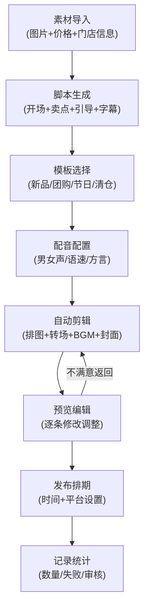

## 1. 产品概述

短视频平台自动化工具，帮助本地商家将商品照片和文案批量生成门店宣传短片。降低短视频制作门槛，提升营销效率。

- 目标用户：本地实体商家、门店运营人员、中小微企业主
- 核心价值：零门槛批量生成高质量门店宣传短视频，支持多平台发布

## 2. 核心功能

### 2.1 用户角色

| 角色 | 注册方式 | 核心权限 |
|------|----------|----------|
| 商家用户 | 手机号/邮箱注册 | 素材管理、视频生成、预览编辑、发布排期、数据统计 |

### 2.2 功能模块

1. **素材导入模块**：商品图片上传、价格录入、优惠信息、门店基础信息管理
2. **脚本生成模块**：自动生成开场文案、卖点描述、行动引导语、字幕内容
3. **模板选择模块**：新品上市、团购促销、节日营销、清仓甩卖四种风格模板
4. **配音设置模块**：男女声选择、语速调节、方言/口音提示设置
5. **自动剪辑模块**：图片自动排序、转场特效、背景音乐匹配、封面图生成
6. **预览编辑模块**：逐条视频预览、内容修改、细节调整
7. **发布排期模块**：发布时间设置、批量排期、发布平台选择
8. **记录统计模块**：生成数量统计、失败原因分析、待审核列表管理

### 2.3 页面详情

| 页面名称 | 模块名称 | 功能描述 |
|-----------|-------------|---------------------|
| 仪表盘 | 概览卡片 | 生成总数、成功率、待审核、今日排期等核心指标展示 |
| 仪表盘 | 快捷操作 | 快速进入各功能模块入口 |
| 素材导入 | 图片上传区 | 拖拽/点击批量上传商品图片，支持预览删除 |
| 素材导入 | 商品信息表 | 价格、优惠、名称、描述等字段录入编辑 |
| 素材导入 | 门店信息卡 | 地址、电话、营业时间、LOGO等门店信息维护 |
| 脚本生成 | 开场文案 | AI自动生成或手动编辑开场吸引语 |
| 脚本生成 | 卖点文案 | 提取商品核心卖点，生成多条备选文案 |
| 脚本生成 | 行动引导 | 生成到店/下单/咨询等引导文案 |
| 脚本生成 | 字幕编辑 | 时间轴字幕预览与编辑 |
| 模板选择 | 模板展示 | 四种风格模板卡片预览，支持hover放大效果 |
| 模板选择 | 模板详情 | 模板参数配置（色调、动画速度、字体风格） |
| 配音设置 | 声音选择 | 男声/女声/多种音色选择 |
| 配音设置 | 语速调节 | 0.5x-2x 语速滑块调节 |
| 配音设置 | 方言提示 | 普通话/方言选项，口音倾向设置 |
| 自动剪辑 | 图片排序列表 | 拖拽排序图片出场顺序 |
| 自动剪辑 | 转场效果 | 多种转场特效选择与预览 |
| 自动剪辑 | 背景音乐 | 曲库选择、音量调节 |
| 自动剪辑 | 封面设置 | 自动截取或手动上传封面图 |
| 预览编辑 | 视频播放器 | 视频预览播放控制 |
| 预览编辑 | 视频列表 | 批量生成的视频列表，点击切换预览 |
| 预览编辑 | 编辑面板 | 逐条修改文案、图片、配音等内容 |
| 发布排期 | 日历视图 | 月/周/日视图展示发布计划 |
| 发布排期 | 时间设置 | 精确到分钟的发布时间设置 |
| 发布排期 | 平台选择 | 抖音、快手、视频号等平台勾选 |
| 记录统计 | 数据仪表盘 | 生成量趋势图、成功率饼图、平台分布图 |
| 记录统计 | 失败记录 | 失败列表与原因分析，支持一键重试 |
| 记录统计 | 待审核 | 人工审核队列，通过/驳回操作 |

## 3. 核心流程

用户上传商品素材 → 填写商品及门店信息 → 选择视频模板风格 → 配置配音参数 → 系统自动生成脚本与剪辑 → 预览逐条修改 → 设置发布排期 → 生成记录与统计数据

## 4. 用户界面设计

### 4.1 设计风格

- **主色调**：深邃靛蓝 #1e1b4b 作为主背景色，搭配电光紫 #8b5cf6 作为品牌主色
- **辅助色**：活力橙 #f97316 用于强调操作按钮，薄荷绿 #10b981 表示成功状态
- **中性色**：深灰 #1f2937 用于卡片背景，浅灰 #9ca3af 用于次要文字
- **按钮风格**：圆角8px，带微妙的渐变光泽和悬浮时的位移阴影效果
- **字体方案**：标题使用 "Space Grotesk" 粗体，正文使用 "Inter" 常规字重
- **布局风格**：左侧导航栏 + 顶部状态栏 + 主内容区的三段式布局，卡片式模块展示
- **图标风格**：Lucide 线性图标，统一 20px 尺寸，颜色跟随状态变化
- **视觉特效**：玻璃拟态卡片、渐变边框、微动效过渡、粒子光效点缀

### 4.2 页面设计概述

| 页面名称 | 模块名称 | UI Elements |
|-----------|-------------|-------------|
| 仪表盘 | 概览卡片 | 深色玻璃拟态卡片，渐变数字，悬浮微动效，彩色进度条 |
| 素材导入 | 上传区 | 虚线边框拖放区，选中态发光边框，缩略图网格布局 |
| 素材导入 | 信息表格 | 斑马纹行，编辑态内联输入框，操作按钮hover变色 |
| 脚本生成 | 文案卡片 | 交替背景色卡片，"换一条"微动效按钮，字数统计标签 |
| 模板选择 | 模板卡片 | 大预览图卡片，选中态紫色渐变边框，角标风格标识 |
| 配音设置 | 控制面板 | 自定义滑块轨道，波形可视化，音色胶囊式选择器 |
| 自动剪辑 | 时间轴 | 横向可滚动时间轴，缩略图拖拽排序，转场图标 |
| 预览编辑 | 播放器 | 深色播放器控件，进度条渐变填充，键盘快捷键提示 |
| 发布排期 | 日历 | 月视图网格，已排期日期圆点标记，时间选择器弹出层 |
| 记录统计 | 图表 | 渐变填充折线图，环形进度图，图标化分类统计 |

### 4.3 响应式设计

- **设计优先**：桌面端优先设计（最小宽度1280px）
- **平板适配**：左侧导航收起为图标模式，主内容区自适应宽度
- **移动适配**：顶部Tab切换导航，卡片单列布局，弹窗全屏展示
- **触摸优化**：交互元素最小高度44px，拖拽操作提供触觉反馈
