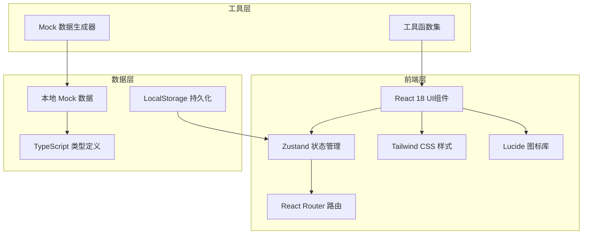

## 1. 架构设计



## 2. 技术描述

- **前端框架**：React@18 + TypeScript
- **构建工具**：Vite@5
- **状态管理**：Zustand@4
- **路由管理**：React Router DOM@6
- **样式方案**：Tailwind CSS@3
- **图标库**：Lucide React
- **后端**：无（纯前端应用，使用Mock数据）
- **数据持久化**：LocalStorage
- **初始化模板**：react-ts（纯前端React+TypeScript项目）

## 3. 路由定义

| 路由 | 页面名称 | 页面用途 |
|-------|---------|---------|
| /dashboard | 仪表盘 | 概览数据展示、快捷操作入口 |
| /materials | 素材导入 | 图片上传、商品信息、门店信息管理 |
| /script | 脚本生成 | 开场文案、卖点、行动引导、字幕编辑 |
| /templates | 模板选择 | 四种风格模板预览与选择配置 |
| /voice | 配音设置 | 声音选择、语速调节、方言设置 |
| /editing | 自动剪辑 | 图片排序、转场、背景音乐、封面设置 |
| /preview | 预览编辑 | 视频播放器、批量预览、逐条修改 |
| /schedule | 发布排期 | 日历视图、时间设置、平台选择 |
| /records | 记录统计 | 数据统计、失败记录、待审核管理 |

## 4. 数据模型

### 4.1 数据模型定义

```mermaid
erDiagram
    PRODUCT {
        string id PK
        string name
        number price
        number originalPrice
        string discount
        string description
        string[] images
        string category
    }
    
    STORE {
        string id PK
        string name
        string address
        string phone
        string businessHours
        string logo
        string description
    }
    
    VIDEO_SCRIPT {
        string id PK
        string opening
        string[] sellingPoints
        string callToAction
        SUBTITLE[] subtitles
    }
    
    SUBTITLE {
        number timestamp
        string text
    }
    
    TEMPLATE {
        string id PK
        string name
        string style
        string primaryColor
        string secondaryColor
        string fontFamily
        string animationSpeed
    }
    
    VOICE_CONFIG {
        string id PK
        string gender
        string tone
        number speed
        string dialect
    }
    
    VIDEO_PROJECT {
        string id PK
        string productId FK
        string templateId FK
        VIDEO_SCRIPT script
        VOICE_CONFIG voiceConfig
        string[] imageOrder
        string transition
        string backgroundMusic
        string coverImage
        string status
        Date createdAt
    }
    
    PUBLISH_SCHEDULE {
        string id PK
        string videoProjectId FK
        Date publishTime
        string[] platforms
        string status
    }
    
    GENERATION_RECORD {
        string id PK
        string videoProjectId FK
        string status
        string errorMessage
        Date createdAt
        boolean needsReview
    }
```



### 4.2 TypeScript 类型定义

```typescript
// 商品
interface Product {
  id: string;
  name: string;
  price: number;
  originalPrice?: number;
  discount?: string;
  description?: string;
  images: string[];
  category?: string;
}

// 门店信息
interface Store {
  id: string;
  name: string;
  address: string;
  phone: string;
  businessHours: string;
  logo?: string;
  description?: string;
}

// 字幕
interface Subtitle {
  timestamp: number;
  text: string;
}

// 视频脚本
interface VideoScript {
  id: string;
  opening: string;
  sellingPoints: string[];
  callToAction: string;
  subtitles: Subtitle[];
}

// 模板
interface VideoTemplate {
  id: string;
  name: string;
  style: 'new' | 'group' | 'festival' | 'clearance';
  primaryColor: string;
  secondaryColor: string;
  fontFamily: string;
  animationSpeed: 'slow' | 'normal' | 'fast';
}

// 配音配置
interface VoiceConfig {
  id: string;
  gender: 'male' | 'female';
  tone: string;
  speed: number;
  dialect: string;
}

// 视频项目
interface VideoProject {
  id: string;
  productId: string;
  templateId: string;
  script: VideoScript;
  voiceConfig: VoiceConfig;
  imageOrder: string[];
  transition: string;
  backgroundMusic: string;
  coverImage?: string;
  status: 'draft' | 'generating' | 'completed' | 'failed' | 'pending_review';
  createdAt: Date;
}

// 发布排期
interface PublishSchedule {
  id: string;
  videoProjectId: string;
  publishTime: Date;
  platforms: string[];
  status: 'scheduled' | 'published' | 'failed';
}

// 生成记录
interface GenerationRecord {
  id: string;
  videoProjectId: string;
  status: 'success' | 'failed' | 'pending_review';
  errorMessage?: string;
  createdAt: Date;
  needsReview: boolean;
}

// 全局状态
interface AppState {
  products: Product[];
  store: Store;
  currentScript: VideoScript | null;
  selectedTemplate: VideoTemplate | null;
  voiceConfig: VoiceConfig;
  videoProjects: VideoProject[];
  schedules: PublishSchedule[];
  records: GenerationRecord[];
}
```
